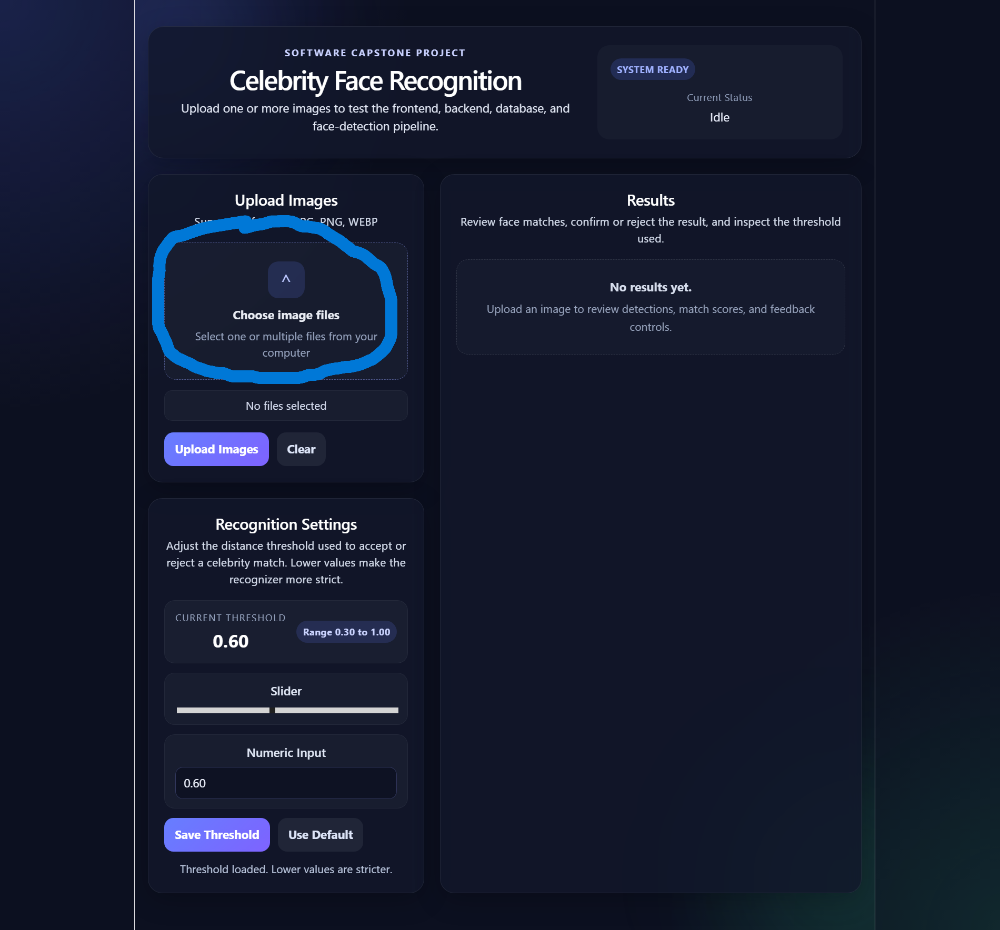
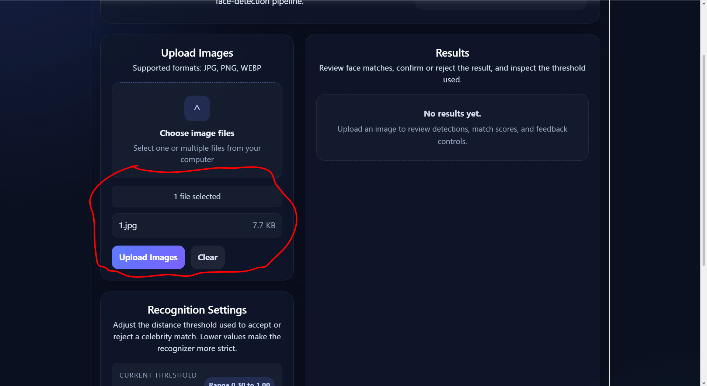
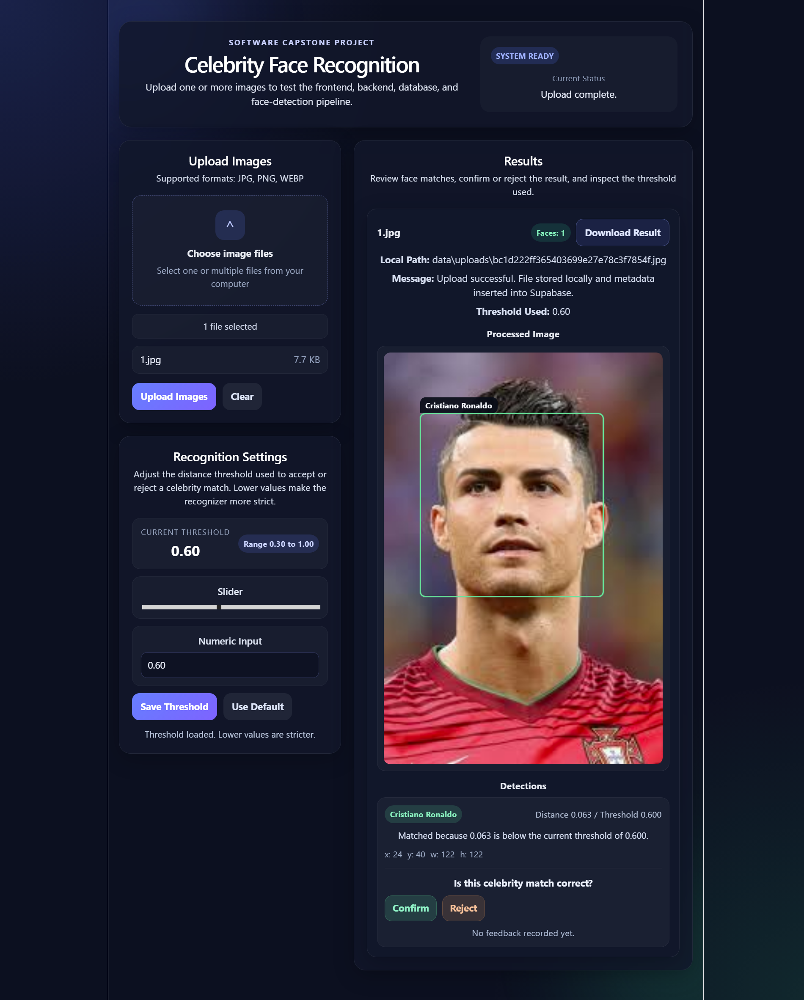

# Celebrity Face Recognition Photo Organizer

Celebrity-Based Face Recognition for Organizing Private Photo Collections

This capstone project is a full-stack face recognition app. A user uploads one or more photos, the backend detects faces, creates embeddings for the uploaded faces, compares them against cached celebrity reference embeddings stored in Supabase, and returns likely matches with distance scores.

<h2 align="center">Architecture Diagram</h2>

<p align="center">
  
</p>

## Current Status

The project now includes:

- React/Vite frontend for uploading images, reviewing results, adjusting the recognition threshold, and submitting match feedback.
- FastAPI backend with upload, health, settings, and feedback endpoints.
- Supabase integration for upload metadata and cached celebrity reference embeddings.
- Cached celebrity embeddings in the `celebrity_embeddings` table so uploads do not regenerate all reference embeddings on every request.
- Local feedback logging to `backend/data/feedback/match_feedback.jsonl`.
- Configurable recognition threshold stored in `backend/data/app_state/recognition_settings.json`.

## Stack

- Frontend: React, TypeScript, Vite
- Backend: FastAPI, Python
- Database/Storage: Supabase
- Image Processing: OpenCV, `face_recognition`, NumPy

## Project Structure

```text
backend/
  app/
    core/                 Supabase and environment configuration
    routes/               FastAPI route handlers
    services/             Face detection, embedding, recognition, database, feedback, settings
  data/
    reference/            Celebrity reference images
    uploads/              Locally stored uploaded images
    feedback/             Local JSONL feedback records
    app_state/            Local app settings
  database/               Supabase SQL setup files
  scripts/                Maintenance scripts

frontend/
  src/                    React app
  public/                 Static frontend assets

docs/                     User and developer documentation
```

## Quick Start

### 1. Backend

Create `backend/.env` with:

```env
SUPABASE_URL=your_supabase_url
SUPABASE_KEY=your_supabase_key
SUPABASE_BUCKET=project-images
SUPABASE_TABLE=processed_images
SUPABASE_CELEBRITY_EMBEDDINGS_TABLE=celebrity_embeddings
```

Install backend dependencies and run the API:

```powershell
cd backend
.\.venv\Scripts\python.exe -m pip install -r requirements.txt
.\.venv\Scripts\python.exe -m uvicorn app.main:app --reload
```

The backend runs at `http://127.0.0.1:8000`.

### 2. Supabase Embedding Cache

Run the SQL in:

```text
backend/database/create_celebrity_embeddings.sql
```

Then populate the cached reference embeddings:

```powershell
cd backend
.\.venv\Scripts\python.exe scripts\cache_celebrity_embeddings.py
```

After this, uploads fetch celebrity embeddings from Supabase and compare immediately instead of rebuilding reference embeddings from image files every time.

### 3. Frontend

Install and run the frontend:

```powershell
cd frontend
npm install
npm run dev
```

Open the Vite URL, usually `http://localhost:5173`.

## Website Walkthrough

### Step 1: Choose Images

When the website first loads, the upload panel is ready for image selection. Users can click the upload area to choose files from their computer.

<p align="center">
  
</p>

### Step 2: Review Selected Files

After selecting images, the app shows how many files are ready, lists the selected file names, and gives the user two choices: upload the images or clear the selection.

<p align="center">
  
</p>

### Step 3: Review Recognition Results

Once processing finishes, the results panel shows the detected face, the celebrity match the AI chose, the distance score, and the threshold used. Users can confirm or reject the match, download the result, and adjust the recognition threshold for future uploads.

<p align="center">
  
</p>

## User Guide

See [docs/user-guide.md](docs/user-guide.md) for the full guide.

Basic flow:

1. Start the backend and frontend.
2. Open the frontend in the browser.
3. Select one or more JPG, PNG, or WEBP images.
4. Click **Upload Images**.
5. Review detected faces, match names, distances, and the threshold used.
6. Confirm or reject returned matches with the feedback controls.
7. Adjust the recognition threshold if matches are too strict or too loose.

## Documentation

- [User Guide](docs/user-guide.md)
- [Technical Documentation](docs/technical-documentation.md)
- [Supabase table setup](backend/database/create_celebrity_embeddings.sql)

## Important Notes

- The celebrity reference cache must be populated before the fastest upload path is available.
- If Supabase has no cached celebrity embeddings, the backend falls back to generating embeddings from `backend/data/reference/`.
- Lower threshold values are stricter. The default threshold is `0.6`.
- Runtime uploads, feedback records, and app settings are local development artifacts and should be reviewed before committing.
