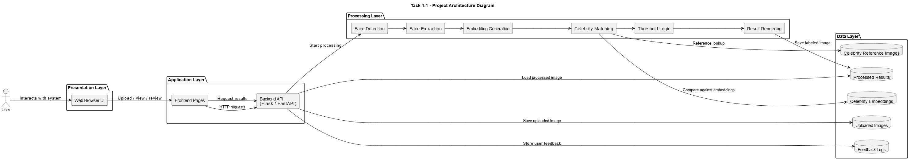

# Software Capstone Project

## Project Title
Celebrity-Based Face Recognition for Organizing Private Photo Collections

## User Interaction diagram:

<h2 align="center">Architecture Diagram</h2>

  

## Stack
- Frontend: React
- Backend: FastAPI (Python)
- Database/Storage: Supabase
- Image Processing: OpenCV / face_recognition

## Structure
- `frontend/` React UI
- `backend/` Python API and processing
- `docs/` diagrams and planning files

## Current Status
Initial scaffold with Supabase integration test support.
